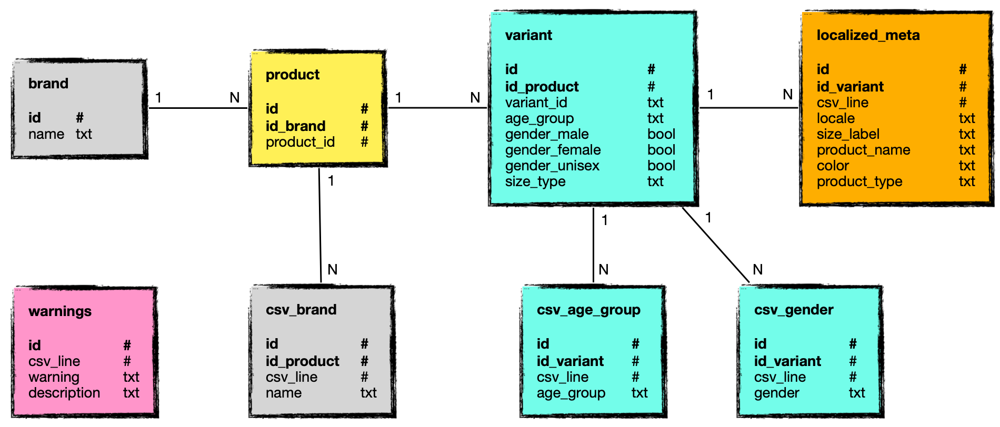

# Prerequisites

### Docker

Docker needs to be installed on your system. Follow the [official instructions](https://docs.docker.com/engine/install) to do so.

### Data file 

You need to create a `data` directory at the root of the git repository and copy your CSV file into this directory, naming it `input.csv`:

```bash
mkdir data
cp <your CSV file> data/input.csv
```

### PostgreSQL Client

On Ubuntu, you can install the client using the following command:

```bash
sudo apt install postgresql-client
```

You will then be able to call the `psql` command from the command line.


# Launching the System

Use the following command to launch the whole system:

```bash
docker compose up
```

This will:

- Pull the PostgreSQL DB docker,
- Build the ingestor docker if necessary,
- Launch both of them,
- Proceed with importing `data/input.csv`.

You may press `Ctrl-C` to stop the system.


# Data Operations

### Database Schema

The SQL script to initialize the database can be found in `bin/initdb/db_reset.sql`.




### Data Persistency

Unless you remove the docker volume, the database won't be erased, even if you stop the docker.

### Ingesting More Data

To import new data, follow the steps:

- Stop the system,
- Replace `data/input.csv` file by a new one, keeping the same name,
- Launch the system again.

### Checking the Database

In another terminal, while the system is still running, and assuming you have installed `psql`, use the following command to output the content of the data on the standard output:

```bash
bin/db-check.sh
```

Alternatively, you can play by yourself with `psql` or any other client of your choice.

- The database uses the standard port `5432` on `localhost`,
- Username: `ingestor`,
- Database: `inventory`.

### Resetting the Database

In another terminal, while the system is still running, and assuming you have installed `psql`, use the following command to empty the database:

```bash
bin/db-reset.sh
```

### Hard Reset

You can do a hard reset by quitting the system with `Crtl-C` and issuing the following command:

```
docker system prune -a
```

**WARNING**: Use this command at your own risk, this will remove all the other docker images and volumes that are on your disk.


# Assumptions and Choices

The assumptions and choices listed here are based on our data analysis of the data and our discussions with the team.

### Assumptions

- Data persistency is not necessary and thus not ensured.
- It is OK to have the user restart the whole system to do a new ingestion.
- It is OK not to have a too user friendly system as this is a proof of concept.
- Most of the processing shall be (and is) done on the fly, at least as much as possible.
- Inconsistencies may appear in the following fields:
	- brand,
	- gender,
	- product\_type,
	- size\_label,
	- age\_group.
- The following fields are localized:
	- size\_label,
	- product\_name,
	- color,
	- product\_type.

For more:

- The raw data analysis of the data using python and pandas can be found in [docs/data-analysis.pdf](docs/data-analysis.pdf).
- The questions and answers can be found in docs/faq.txt.

### Choices

- We chose maven to manage the java dependencies and do the packaging.
- We chose not to develop unit tests at this time as it is a proof of concept.

### Unavailable Commands

- We have developed a set of scripts for end-to-end testing, those won't work unless you have maven installed and the proper data files (which could be provided if requested).


# Data Validation and Cleaning

This section elaborates on the data validation and cleaning that is performed by the system.

### Normalizing Text

- Words are normalized with the first letter being uppercase and the remainings lowercase.
- White spaces are trimmed.

### Discarding Missing Fields

CSV lines with missing fields are not ingested and an entry is added to the *warnings* table, e.g:

```bash
 id | csv_line |           warning            |                  description                  
----+----------+------------------------------+-----------------------------------------------
 34 |        9 | WARNING_EMPTY_FIELD          | Line dropped - No content for field 7
```

### Determining the Locale

The locale is determined for each row of the *localized\_meta* table. This is done using the Apache language detector *Optimaize* from the package `org.apache.tika.langdetect.optimaize.OptimaizeLangDetector`.

### Brand

The data analysis shows us that 

Different CSV rows may refer to the same *product\_id* with different values for the found with more than one *brand*. We assume a product belongs to only one brand and that therefore all the names are all synonyms of the same brand. However:

1. We still need to associate only one *brand* name to the *product\_id*
2. Data inquieries have shown there are some cases of totally different names

The resolution is two-fold:

1. for each given *product\_id*, we compute the frequency of appearance of each *brand* name and elect the most frequent one as the representative and update the *brand* table accordingly. 

2. when more than 1 *brand* name is encountered for the same product, we run string similarity computation (subset, JaroWinkler, Jaccard) on the names and we flag *brand* names which are under 80% similar to the other ones.

In both cases, we still ingest the line and an entry is added to the *warnings* table, e.g:

```bash
 id | csv_line |           warning            |                  description                  
----+----------+------------------------------+-----------------------------------------------
  7 |       34 | WARNING_MULTIPLE_BRAND_NAMES | Multiple brand names - Chosen name: Ami paris
  8 |       21 | WARNING_OUTLIER_BRAND_NAME   | Outlier brand - Too different from other names: Capucine
```

Note: In order to have all the data to consider, the cleaning described in this section is done once all the CSV file has been ingested.

### Gender

The example below is clearly not a localization and should be flagged, and possibly fixed automatically.

```text
row        variant_id     gender    product_type
1272828    12620014-17    Female    Jewellery > Earrings
1988493    12620014-17    Unisex    Fine Jewellery > Fine Earrings
```

Such collisions are resolved naturally by storing the 3 possible genders for each variant using a boolean. That way we leave the possibility that a variant may apply to different genders depending on the culture.

### Product Type

We may have 2 rows or more with the same variant\_id value and a different product\_type value. We have identified 2 possible cases:

(a) Localization:

```text
row        variant_id     product_type
2107843    14924756-42    Jewellery > Rings
2349353    14924756-42    Bijoux > Bagues
```

(b) Different product\_type for the same language:

```text
row        variant_id     product_type
1272828    12620014-17    Jewellery > Earrings
1988493    12620014-17    Fine Jewellery > Fine Earrings
```

Case (a) looks perfectly normal to me. Case (b) is problematic as it prevents us from adding to to localized\_meta and therefore. Flagging this has not been implemented at the stage of this proof of concept, however, we believe we would use the same principles and apply the same code as for Brand cleaning.

### Size Label

Two rows with the same variant\_id may have different size\_label

The example below is clearly a localization case and is OK:

```text
row       variant_id     size_label
337840    17659877-17    40厘米
618246    17659877-17    40 cm
```

This other example may or may not be a localization case:

```text
row       variant_id     size_label    product_type
150573    17482131-20    6 US          Kleidung > Kleider > Tageskleider
208845    17482131-20    4 US          Clothing > Dresses > Day Dresses
```

Again, this has not been implemented at the stage of this proof of concept, however, we believe we would use the same principles and apply the same code as for Brand cleaning.

### Age Group

In some cases, the age group varies although the product type is the same:

```text
row        variant_id     age_group    product_type
3879       13221865-19    Kids         Boys Shoes > Boys Trainers
2019990    13221865-19    Adult        Boys Shoes > Boys Trainers
```

This is clearly not a localization and should be flagged, and possibly fixed automatically. This has not been implemented at the stage of this proof of concept, however, we believe we would use the same principles and apply the same code as for Brand cleaning.

### Color

We believe there may also be inconsistencies in the *color* field. This could be handled leveraging the localization.


# Future Work

This proof of concept could, at least, be extended as follows:

### Data Processing

- Adding the flagging that has not been yet implemented.
- Doing automatic resolution of some conflicts such as color or size\_label.
- Finding more possible issues and adding detection for them.

### User Experience

- Generate report charts regarding the quality and consistency of the data.
- Add an API to support sending a CSV.

### System

- Database persistency.
- Code optimization.
- Unit tests.
- Additional end-to-end tests.
